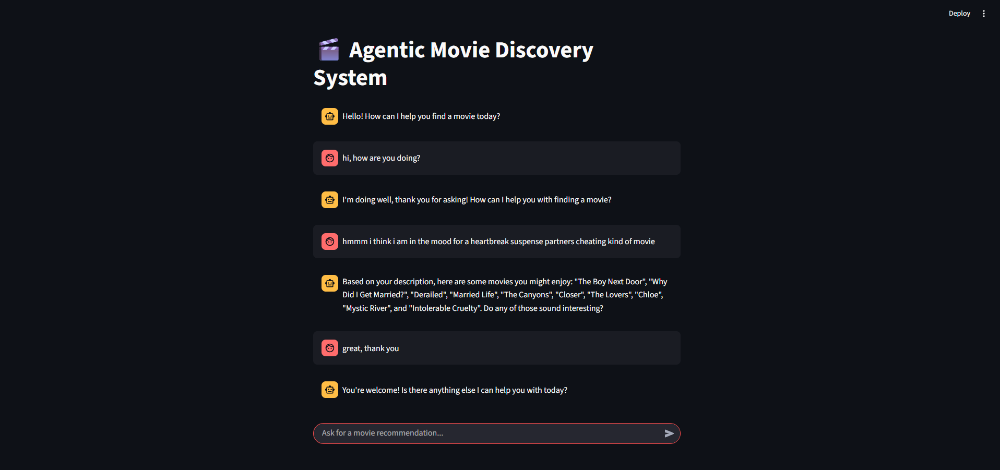

# 🎬 Agentic Movie Discovery System

This project is a sophisticated, conversational AI agent designed to provide intelligent movie recommendations. Built with Python, Streamlit, and powered by Google's Gemini, this agent can understand natural language requests and use specialized tools to find the perfect movie based on descriptive queries or by finding titles similar to a user's favorite films.

---



---

## ✨ Features

- **Conversational Interface:** Interact with the agent through an intuitive chat interface built with Streamlit.
- **Recommendation by Description:** Ask for movies in your own words (e.g., "a funny sci-fi movie from the 90s about aliens"). The agent uses semantic search to find the best matches.
- **Recommendation by Title:** Ask for movies similar to a specific title (e.g., "movies like Inception").
- **Tool-Using AI:** The agent's core is a Large Language Model (LLM) that intelligently decides which recommendation tool to use based on the user's request.
- **Scalable Backend:** Movie embeddings are stored and queried efficiently using a local ChromaDB vector store.

---

## 🛠️ Tech Stack

- **Backend:** Python
- **AI & Machine Learning:**
  - **LLM Framework:** Langchain
  - **LLM:** Google Gemini
  - **Embeddings:** `sentence-transformers`
  - **Vector Store:** ChromaDB
  - **Data Handling:** Pandas, NumPy
- **Frontend:** Streamlit

---

## 🚀 Setup and Installation

Follow these steps to get the project running on your local machine.

### **Part 1: Data Pipeline - Generating and Ingesting Embeddings**

This is the most critical part of the setup. We will first process the raw data on Kaggle to create vector embeddings and then load them into our local database.

#### **Step 1.1: Download Raw Data**
You will need the **TMDB 5000 Movie Dataset** from Kaggle.
- Download `tmdb_5000_movies.csv` and `tmdb_5000_credits.csv`.
- Create a `data` folder in the project root but **do not place these files there yet.** They are the input for the Kaggle notebook.

#### **Step 1.2: Generate Embeddings on Kaggle**
To handle the computationally heavy task of creating embeddings for thousands of movies, I used a Kaggle notebook to access their free GPU resources.

- **Access the Notebook:** Acess public Kaggle notebook for this project:
  [**View the Kaggle Notebook**](https://www.kaggle.com/code/adityabhardwaj021/movie-recommendation-ai-agent)

- **What I did in Notebook:** The notebook performs the following steps:
    1.  Loads and merges the two raw `.csv` files.
    2.  Creates a text "soup" for each movie by combining its title, overview, genres, keywords, cast, and director.
    3.  Uses the powerful `sentence-transformers/all-MiniLM-L6-v2` model to convert each movie's "soup" into a 384-dimensional numerical vector (an embedding).
    4.  Saves the result and titles into two clean, synchronized files.


#### **Step 1.3: Ingest Data into the Local Vector Store**
Now that you have the processed files, you can load them into your local ChromaDB.
1.  Place the downloaded `movie_embeddings.npy` and `movie_titles.csv` files into the `data` folder in your project.
2.  Run the ingestion script. This script will read the two files and load each embedding into the vector store, using the movie titles as the metadata.
    ```bash
    python ingest.py
    ```
This will create a `chroma_db` folder in your project directory. This is a one-time setup.

### **Part 2: Running the Application**

#### **Step 2.1: Clone the Repository**
```bash
git clone https://github.com/adityabhardwaj011/Agentic-Movie-Recommender.git
```

#### **Step 2.2: Create a Virtual Environment**
```bash
# For Windows
python -m venv venv
venv\Scripts\activate

# For macOS/Linux
python3 -m venv venv
source venv/bin/activate
```

#### **Step 2.3: Install Dependencies**
```bash
pip install -r requirements.txt
```

#### **Step 2.4: Set Up Environment Variables**
Create a file named `.env` in the root of the project directory and add your Google Gemini API key:
```
GOOGLE_API_KEY="your_google_api_key_here"
```

#### **Step 2.5: Run the Application**
Launch the Streamlit web application.
```bash
streamlit run app.py
```
Your Agentic Movie Discovery System should now be running in your browser!

---

## 💬 How to Use

Simply start a conversation with the agent. You can try queries like:
- "Suggest some sci-fi movies with a strong female lead"
- "I want to watch a mystery that takes place on a train"
- "Find movies similar to The Dark Knight"